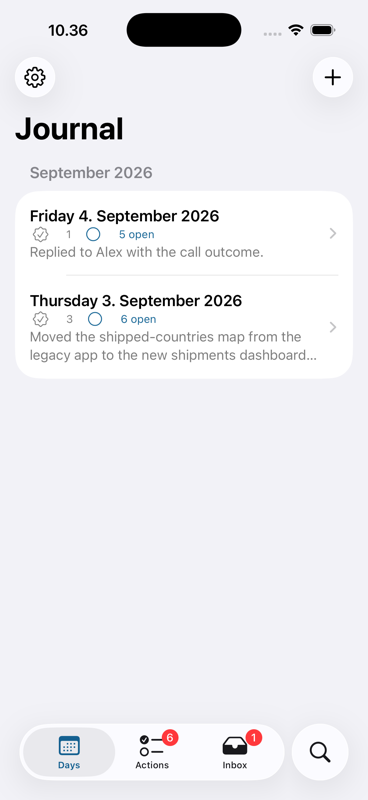
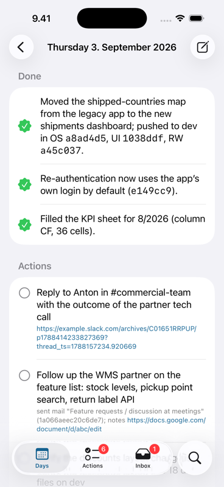

# daily-journal

A private daily work journal, written for you by Claude Code. Once a day you run `/daily-journal` and it turns the day's evidence — your git commits, your Claude Code session transcripts, your Google Calendar meetings and their Gemini notes, Gmail (received and sent), Google Docs edited that day, Slack messages and quick captures from your phone — into one Markdown file: a short **Done** list, an **Actions** checklist with a source reference on every line, the items **Carried over** from the previous day, and a **Details** section with links so anything can be picked up later. Open actions follow you from day to day until you tick them.

## The two parts

- **`plugin/`** — a Claude Code plugin with the `daily-journal` skill and its collector scripts. This is the writer: it runs on the Mac that has your repos, transcripts and `gws` login.
- **`ios/`** — an iOS app that reads the same folder from iCloud Drive: shows today's entry, lets you tick actions, and drops quick captures into `inbox/` that the next journal run folds in. See below.
- **`mac/`** — the same app for macOS, reading the journal folder directly. It shares the file, store and rendering code with `ios/`.

Both sides follow the same file contract, `spec/JOURNAL_FORMAT.md`.

## Requirements

- [Claude Code](https://claude.com/claude-code)
- `python3` 3.11 or newer (standard library only)
- Optional: the [`gws`](https://github.com/googleworkspace/cli) CLI for Calendar, Gmail and Docs — `brew install googleworkspace/tap/gws`, then `gws auth login`. Without it those sections are skipped and the journal says so.
- Optional: a Slack MCP server with a message-search tool connected to Claude Code. Without it the journal notes "Slack: not connected".

## Install

This repository is its own Claude Code plugin marketplace. In Claude Code:

```
/plugin marketplace add pylenius/daily-journal
/plugin install daily-journal@pylenius
```

or from the shell:

```bash
claude plugin marketplace add pylenius/daily-journal
claude plugin install daily-journal@pylenius
```

Alternatively copy the skill into a project or your home directory:

```bash
cp -R plugin/skills/daily-journal ~/.claude/skills/daily-journal
```

## Configure

Create `~/.config/daily-journal/config.json` (start from `plugin/config.example.json`). Only `journal_dir` is required; the collector prints the example and exits when the file is missing. The env var `DAILY_JOURNAL_CONFIG` points it at another file.

```json
{
  "journal_dir": "~/Library/Mobile Documents/com~apple~CloudDocs/Journal",
  "timezone": "Europe/Helsinki",
  "me": { "name": "Your Name", "email": "you@example.com" },
  "git": { "roots": ["~/Coding/myOGO"], "depth": 1, "author": "Your Name" },
  "claude": { "projects_dir": "~/.claude/projects", "project_filter": [] },
  "google": {
    "enabled": true,
    "calendar_id": "primary",
    "gmail_exclude_categories": ["promotions", "updates", "social", "forums"],
    "gmail_noise_senders": ["noreply", "no-reply", "notifications@", "calendar-notification", "gemini-notes@"]
  },
  "slack": { "enabled": true, "handle": "yourhandle" }
}
```

- `journal_dir` — where the entries live. Put it in iCloud Drive if you use the iOS app. `~` expands.
- `timezone` — IANA name; day boundaries are local midnight there. Defaults to the machine's zone.
- `me.name` — matched against the assignee tags in Gemini "Next steps"; `me.email` — used to spot you in attendee lists.
- `git.roots` — directories to scan for repositories. Each root is scanned itself and one level down; `depth: 2` also looks one level deeper (children of a directory that is itself a repo are not descended into). `git.author` is passed to `git log --author`.
- `claude.projects_dir` — where Claude Code keeps transcripts. `project_filter` — if non-empty, only project directories whose name contains one of these substrings are read.
- `google.enabled` — set to `false` to skip Calendar/Gmail/Docs entirely. The category and sender lists filter noise out of Gmail.
- `slack.handle` — your Slack handle without `@`, used in the search queries.

## Run

Inside Claude Code:

- `/daily-journal` — today's entry
- `/daily-journal yesterday` — yesterday's (the usual morning run)
- `/daily-journal 2026-09-03` — a specific day; several days are processed oldest first so carry-over chains

The collector takes one to three minutes when Google sources are enabled. Claude then reads the raw material, runs the Slack searches if a tool is available, writes the entry, archives the inbox captures and shows you the Done and Actions lists.

## Where files go

```
<journal_dir>/
├── YYYY-MM-DD.md            one entry per day
└── inbox/
    ├── *.md                 captures from the phone, waiting for the next run
    └── archive/YYYY-MM/     captures already folded into an entry
```

Raw material (exported docs, the collector's `raw.md`) is written to `$TMPDIR/daily-journal/<date>/` (or Claude Code's scratchpad) and is safe to delete.

Manual inbox management: `inbox.py list` prints the pending captures as JSON, `inbox.py archive [--dry-run]` moves them to the archive without overwriting anything.

## Privacy

Journal entries contain names, customer details, figures from meeting notes and email excerpts. Treat the folder as confidential:

- Everything is written locally. Nothing leaves the machine except the queries the collector makes to **your own** Google and Slack accounts through `gws` and your Slack MCP server.
- iCloud Drive is end-to-end encrypted only when [Advanced Data Protection](https://support.apple.com/en-us/102651) is turned on for your Apple account; without it Apple holds the keys.
- The skill never publishes an entry, never pastes it into chat tools, and never commits it unless you ask.

## Optional: open actions at session start

Add a SessionStart hook so every new Claude Code session starts knowing what is pending. In `.claude/settings.json` (project or user level):

```json
{
  "hooks": {
    "SessionStart": [
      {
        "matcher": "",
        "hooks": [
          { "type": "command", "command": "bash /path/to/daily-journal/plugin/skills/daily-journal/scripts/open-actions.sh" }
        ]
      }
    ]
  }
}
```

The script prints the unchecked items from the latest entry's Actions and Carried over sections as additional context, and nothing when there is no journal yet.

## iOS app

`ios/` holds **Journal**, a native SwiftUI app for iPhone and iPad (iOS 18+). It works directly on the journal folder — no server, no account:

| | |
|---|---|
|  |  |

- **Days** — every entry, grouped by month, with done and open-action counts.
- **Entry** — Done, Actions and Carried over as native rows (tap the circle to tick; links open in the browser; references are copyable), Details rendered as Markdown. Ticking edits the file in place: exactly one line changes, nothing is re-serialised.
- **Actions** — every open action across all days, one per action even when it was carried over for a week; ticking writes to the newest day's file, which is what the next Mac run reads.
- **Search** — every line of every entry, all words must match on the same line.
- **Inbox** — captures waiting for the next run; **+** adds a note or action as a file in `inbox/`. "Add to Journal" is also available as a Shortcut / Siri action.
- **Edit** — raw Markdown editor with a stale-file guard: if the Mac rewrote the entry while you were editing, you choose overwrite, discard or copy.

Sync is whatever the Files app provides. The app asks you to pick the journal folder once (iCloud Drive, OneDrive, Google Drive, … any provider that supports opening in place) and keeps a bookmark. Reads and writes go through file coordination; iCloud conflict versions are merged with the spec rule — newest body wins, a box ticked in any version stays ticked.

### Build

```bash
brew install xcodegen
cd ios
cp Signing.xcconfig.example Signing.xcconfig   # add your DEVELOPMENT_TEAM and a bundle id
./bootstrap.sh                                  # generates Journal.xcodeproj (git-ignored)
open Journal.xcodeproj
```

Run on the simulator or your device from Xcode. The parser and file logic live in the `ios/Packages/JournalKit` Swift package, which has no UI dependency and is tested with `swift test --package-path ios/Packages/JournalKit`. For UI work on the simulator, launch arguments `-journalFolder /path/to/folder` and `-openDate YYYY-MM-DD` skip the picker.

## Mac app

`mac/` holds **Journal** for macOS 15+. It works on the same folder as the iOS app, with the same features, in a three-column window: Days / Actions / Inbox in the sidebar, the list in the middle, the entry on the right. Search is the sidebar field; right-click a Done item to highlight or remove it, or an action to tick it or copy its reference.

Shortcuts: ⇧⌘N quick capture · ⌘T today · ⌘E edit entry · ⌘R reload · ⇧⌘O choose folder · ⌘, settings.

The Mac project has no copies of its own for the shared parts. It compiles `ios/Journal/Storage`, `Store`, `Rendering`, `Intents` and the row views directly, and uses `ios/Packages/JournalKit`. Only the window and views are Mac-specific.

```bash
cd mac
cp Signing.xcconfig.example Signing.xcconfig   # add your DEVELOPMENT_TEAM and a bundle id
./bootstrap.sh                                  # generates JournalMac.xcodeproj (git-ignored)
open JournalMac.xcodeproj
```

Release builds are sandboxed and remember the folder with a security-scoped bookmark. Debug builds run unsandboxed, so the launch arguments `-journalFolder /path/to/folder` and `-openDate YYYY-MM-DD` work there as they do on the simulator.

Android is planned as a separate app over the same files; the format is fully described in `spec/JOURNAL_FORMAT.md`.

## License

MIT — see `LICENSE`.
